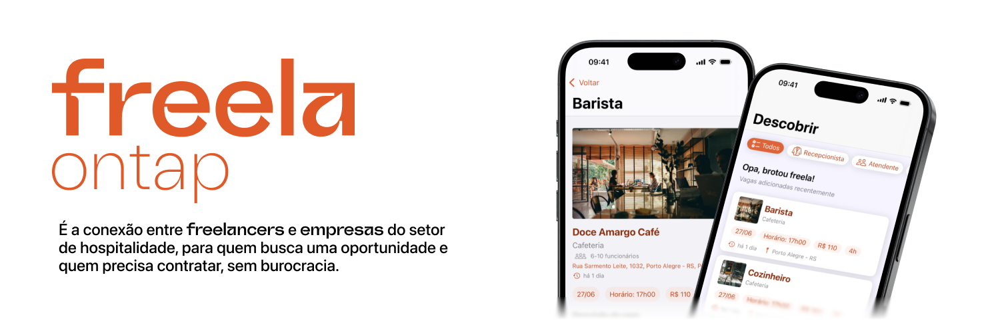
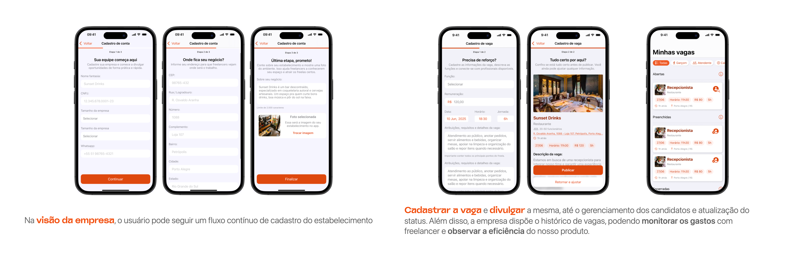
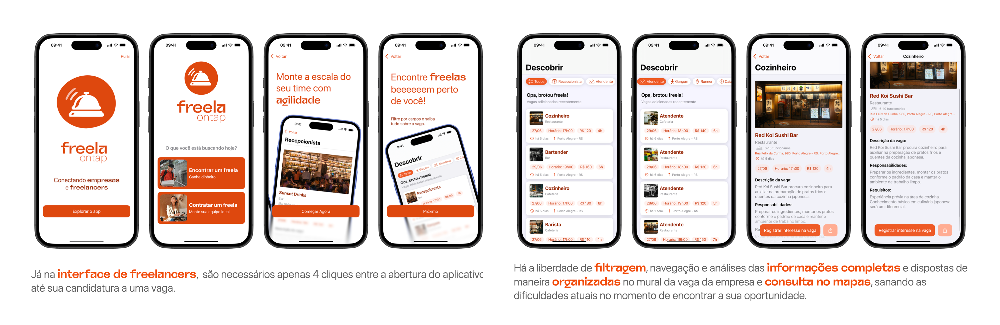

# Freela onTap

O Freela onTap é um **aplicativo para iOS** que conecta freelancers e empresas do setor de hospitalidade, para quem busca uma oportunidade e quem precisa contratar, sem burocracia e de forma ágil.

---

### O Problema

O setor de hospitalidade, apesar de seu enorme potencial, enfrenta um desafio constante: a dificuldade de encontrar profissionais qualificados rapidamente. O processo atual para preencher vagas emergenciais ou de alta demanda é descentralizado e caótico, dependendo de indicações e grupos informais. Isso gera um cenário de incerteza e desorganização tanto para os donos de estabelecimentos quanto para os freelancers.

### A Solução e Principais Funcionalidades

O Freela onTap ataca esse problema de frente, centralizando e organizando a conexão entre as duas partes em uma plataforma nativa para iOS, focada em agilidade, simplicidade e confiança.

| Funcionalidade | Descrição |
| :--- | :--- |
| **Mural de Vagas Inteligente** | Um feed centralizado onde freelancers encontram as melhores oportunidades, com filtros e busca para encontrar a vaga ideal. |
| **Jornada de Contratação Simplificada** | Empresas podem postar uma vaga em poucos passos, gerenciar os candidatos de forma organizada e contratar com eficiência. |
| **Comunicação Direta** | Um canal direto para que as partes combinem os detalhes do serviço, agilizando o processo. |
| **Informações Claras** | Todas as vagas apresentam informações essenciais como valores, horários e localização no mapa, acabando com a incerteza. |

--- 

---

### Pesquisa e Validação de Mercado

O desenvolvimento do Freela onTap foi guiado por uma extensa pesquisa para validar tanto o problema quanto o potencial de mercado. Nossas descobertas mostram uma clara oportunidade:

- **A Dor Principal:** Entrevistas com donos de bares e restaurantes validaram a percepção de um "completo caos e desorganização" na hora de contratar freelancers.
- **Mercado Local:** Apenas em Porto Alegre, existem mais de **5.000 estabelecimentos** que são potenciais usuários da plataforma.
- **Potencial de Mercado Nacional:** O setor de hospitalidade arrecada cerca de **R$ 217 bilhões** anualmente no Brasil, evidenciando a relevância econômica da solução.

### Design

A interface do Freela onTap foi projetada com dois princípios chave: **agilidade e simplicidade**. Queremos conectar empresas e freelancers de maneira simples e eficaz.

Para isso, seguimos as **Human Interface Guidelines (HIG) da Apple**, garantindo uma experiência de usuário nativa, intuitiva e familiar para os usuários de iOS. A análise de mais de 30 concorrentes  em nosso benchmark nos ajudou a definir uma interface limpa e focada no que realmente importa: a vaga e a candidatura.

### Arquitetura e Stack de Tecnologia

Construímos o Freela onTap como um aplicativo nativo para garantir a melhor performance, segurança e experiência do usuário.

- **Plataforma:** iOS
- **Linguagem:** Swift
- **Framework de UI:** UIKit
- **Arquitetura:** MVC (Model-View-Controller)
- **Backend e Dados:** CloudKit

### Autores

Este projeto é o resultado do trabalho colaborativo de uma equipe dedicada.

> **✨ Destaque:** O "Freela onTap" foi um dos projetos apresentados no showcase oficial da **Apple Developer Academy (Turma 2025-2026)**, realizado no Tecnopuc em 27 de junho de 2025.  O evento reuniu estudantes, mentores e membros da comunidade para apresentar soluções inovadoras desenvolvidas para o ecossistema Apple. O projeto foi apresentado ao público por **Vinicius Cadore** e **Gustavo Bassani**. [Leia a matéria completa aqui](https://tecnopuc.pucrs.br/turma-2025-2026-da-apple-developer-academy-apresenta-projetos-em-showcase/).

- **Adriel de Souza (iOS Developer)** - [GitHub](https://github.com/dsadriel) | [LinkedIn](https://www.linkedin.com/in/dsadriel/)
- **Ana Poletto (iOS Developer)** - [GitHub](https://github.com/AnaPolettoo) | [LinkedIn](https://www.linkedin.com/in/ana-poletto-2a7222318/)
- **Giulia Stefainski (iOS Developer)** - [GitHub](https://github.com/gstfnsk) | [LinkedIn](https://www.linkedin.com/in/giulia-cs/)
- **Gustavo Bassani (iOS Developer)** - [GitHub](https://github.com/GustavoFBassani) | [LinkedIn](https://www.linkedin.com/in/gustavo-ferreira-bassani-9778ab266/)
- **Vinicius Cadore (UI/UX Designer)** - [GitHub](https://github.com/cadoreee) | [LinkedIn](https://www.linkedin.com/in/cadoreee/)